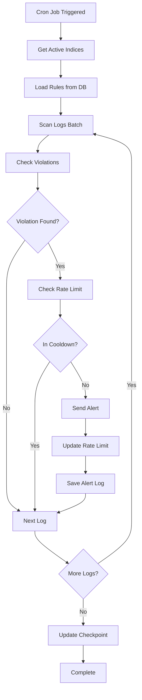
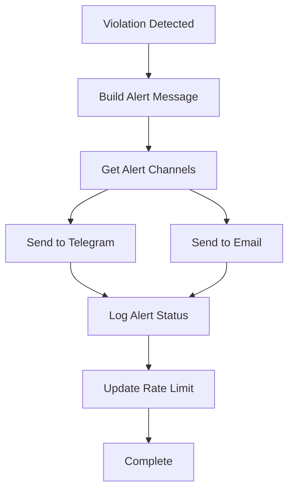

# Hyperf Monitoring Service

Sistem monitoring dan alerting berbasis Hyperf untuk memantau performa aplikasi melalui log Elasticsearch dengan notifikasi real-time.

## 📋 Overview

Project ini adalah sistem monitoring yang mengintegrasikan Elasticsearch untuk scanning log aplikasi dan mengirimkan alert otomatis ketika terjadi pelanggaran durasi yang telah dikonfigurasi. Sistem ini dirancang untuk memantau performa aplikasi secara real-time dan memberikan notifikasi melalui Telegram dan Email.

## 🚀 Fitur Utama

- **Dashboard Real-time**: Statistik performa aplikasi dengan visualisasi data
- **Alerting Otomatis**: Notifikasi ketika durasi aplikasi/proses melebihi threshold
- **Multi-channel Notifications**: Telegram dan Email dengan konfigurasi dinamis
- **Rule Management**: API untuk mengelola App Rules dan Message Rules
- **Performance Monitoring**: Tracking durasi, violation rate, dan log distribution
- **Rate Limiting**: Mencegah spam alert dengan cooldown system
- **Checkpoint System**: Resume scanning dari titik terakhir untuk efisiensi

## 🏗️ Arsitektur

```
┌─────────────────┐    ┌──────────────────┐    ┌─────────────────┐
│   Elasticsearch │    │  Hyperf Service  │    │   Notifications │
│                 │◄───┤                  ├───►│                 │
│ • Log Storage   │    │ • Dashboard API  │    │ • Telegram      │
│ • Search API    │    │ • Rule Engine    │    │ • Email         │
│ • Scroll API    │    │ • Alert Service  │    │ • Rate Limiting │
└─────────────────┘    └──────────────────┘    └─────────────────┘
                                │
                                ▼
                       ┌──────────────────┐
                       │     Database     │
                       │                  │
                       │ • App Rules      │
                       │ • Message Rules  │
                       │ • Alert Logs     │
                       │ • Checkpoints    │
                       └──────────────────┘
```

## 📦 Requirements

- **PHP**: >= 8.1
- **Swoole**: >= 5.0 (dengan `swoole.use_shortname` = `Off`)
- **MySQL**: >= 5.7
- **Elasticsearch**: >= 7.0
- **Redis**: >= 6.0 (untuk caching dan queue)

## 🛠️ Installation

### 1. Clone Repository

```bash
git clone <repository-url>
cd hyperf-monitoring-service
```

### 2. Install Dependencies

```bash
composer install
```

### 3. Environment Configuration

Copy file environment dan konfigurasi:

```bash
cp .env.example .env
```

Edit file `.env` dengan konfigurasi yang sesuai:

```env
# Database Configuration
DB_DRIVER=mysql
DB_HOST=localhost
DB_PORT=3306
DB_DATABASE=hyperf_monitoring
DB_USERNAME=your_username
DB_PASSWORD=your_password

# Elasticsearch Configuration
ELASTICSEARCH_HOST=localhost:9200
ELASTICSEARCH_INDEX_PREFIX=your_app

# Redis Configuration
REDIS_HOST=localhost
REDIS_AUTH=null
REDIS_PORT=6379
REDIS_DB=0

# Telegram Configuration
TELEGRAM_BOT_TOKEN=your_bot_token
TELEGRAM_CHAT_ID=your_chat_id
TELEGRAM_GROUP_ID=your_group_id

# Email Configuration
MAIL_MAILER=smtp
MAIL_HOST=smtp.gmail.com
MAIL_PORT=587
MAIL_USERNAME=your_email@gmail.com
MAIL_PASSWORD=your_app_password
MAIL_ENCRYPTION=tls
MAIL_FROM_ADDRESS=your_email@gmail.com
MAIL_FROM_NAME="Monitoring Service"
```

### 4. Database Setup

Jalankan migration untuk membuat tabel:

```bash
php bin/hyperf.php migrate
```

### 5. Seed Initial Data

```bash
php bin/hyperf.php seed:rules
```

## 🔧 Configuration

### App Rules Configuration

App Rules mendefinisikan threshold durasi maksimal untuk setiap aplikasi:

```php
// Contoh konfigurasi App Rule
{
    "app_name": "core-service",
    "max_duration": 5000,  // 5 detik dalam milliseconds
    "is_active": true,
    "alert_channels": ["telegram_chat", "email"],
    "cooldown_minutes": 15
}
```

### Message Rules Configuration

Message Rules mendefinisikan threshold durasi untuk proses/message spesifik:

```php
// Contoh konfigurasi Message Rule
{
    "app_name": "core-service",
    "message_key": "user_registration",
    "max_duration": 3000,  // 3 detik dalam milliseconds
    "is_active": true,
    "alert_channels": ["telegram_group"],
    "cooldown_minutes": 10
}
```

### Alert Targets Configuration

Konfigurasi target notifikasi dinamis melalui database:

```sql
-- Contoh Alert Target
INSERT INTO alert_targets (name, type, external_id, is_active) VALUES
('Dev Team Chat', 'telegram_chat', '-123456789', 1),
('Ops Email', 'email', 'ops@company.com', 1);
```

## 🔄 Flow System

### 1. Log Scanning Flow



### 2. Alert Processing Flow



## 📊 API Endpoints

### Dashboard API

```bash
# Get dashboard overview
GET /dashboard/overview

# Response
{
    "status": "success",
    "data": {
        "total_logs": 125000,
        "active_apps": {
            "total": 5,
            "apps": [...]
        },
        "violations": {
            "total": 45,
            "by_type": {
                "app": 30,
                "message": 15
            },
            "violation_rate": 0.36
        },
        "avg_duration": {
            "overall_ms": 1250.5,
            "by_app": [...]
        },
        "log_level_distribution": [...]
    }
}
```

### Monitor API

```bash
# Get server status
GET /monitor/server

# Trace by correlation ID
GET /monitor/trace?correlation_id=abc123

# Violations by app
GET /monitor/violation/by-app?app_name=core-service

# Violations by message
GET /monitor/violation/by-message?message_key=user_registration
```

### Rules Management API

```bash
# App Rules CRUD
GET    /rules/app
POST   /rules/app
GET    /rules/app/{id}
PUT    /rules/app/{id}
DELETE /rules/app/{id}

# Message Rules CRUD
GET    /rules/message
POST   /rules/message
GET    /rules/message/{id}
PUT    /rules/message/{id}
DELETE /rules/message/{id}
```

## ⚙️ Commands

### Available Commands

```bash
# Scan logs and send alerts
php bin/hyperf.php log:alert-scan

# Check active rules
php bin/hyperf.php check:rules

# Check checkpoints status
php bin/hyperf.php check:checkpoints

# Check cron execution logs
php bin/hyperf.php check:cron-logs

# Diagnose system
php bin/hyperf.php diagnose

# Test Telegram integration
php bin/hyperf.php test:telegram

# Seed initial rules
php bin/hyperf.php seed:rules
```

### Cron Configuration

Tambahkan ke crontab untuk menjalankan scanning otomatis:

```bash
# Scan logs setiap 5 menit
*/5 * * * * cd /path/to/project && php bin/hyperf.php log:alert-scan

# Check system health setiap jam
0 * * * * cd /path/to/project && php bin/hyperf.php diagnose
```

## 🐳 Docker Support

### Docker Compose

```bash
# Start all services
docker-compose up -d

# View logs
docker-compose logs -f

# Stop services
docker-compose down
```

### Dockerfile

```dockerfile
FROM hyperf/hyperf:8.1-alpine-v3.16-swoole

WORKDIR /opt/www

COPY . /opt/www

RUN composer install --no-dev -o && \
    php bin/hyperf.php migrate && \
    php bin/hyperf.php seed:rules

EXPOSE 9501

CMD ["php", "bin/hyperf.php", "start"]
```

## 📈 Performance Optimization

### Elasticsearch Optimization

- **Scroll API**: Menggunakan scroll untuk batch processing yang efisien
- **Search After**: Pagination dengan search_after untuk performa yang lebih baik
- **Aggregations**: Menggunakan ES aggregations untuk statistik yang cepat
- **Index Filtering**: Hanya scan index yang relevan (core, merchant, transaction, vendor)

### Database Optimization

- **Checkpoint System**: Resume scanning dari titik terakhir
- **Rate Limiting**: Mencegah spam alert dengan cooldown
- **Batch Processing**: Proses log dalam batch untuk efisiensi memory
- **Indexing**: Database indexes pada kolom yang sering diquery

## 🔍 Monitoring & Logging

### Log Files

- **Application Logs**: `runtime/logs/hyperf.log`
- **Alert Logs**: Database table `alert_logs`
- **Cron Execution Logs**: Database table `cron_execution_logs`

### Health Checks

```bash
# Check system health
php bin/hyperf.php diagnose

# Check Elasticsearch connection
php bin/hyperf.php check:elasticsearch

# Check database connection
php bin/hyperf.php check:database
```

## 🚨 Troubleshooting

### Common Issues

1. **Elasticsearch Connection Error**
   ```bash
   # Check ES status
   curl http://localhost:9200/_cluster/health
   ```

2. **Database Connection Error**
   ```bash
   # Check database connection
   php bin/hyperf.php check:database
   ```

3. **Telegram Bot Not Working**
   ```bash
   # Test Telegram integration
   php bin/hyperf.php test:telegram
   ```

4. **Memory Issues**
   ```bash
   # Check memory usage
   php bin/hyperf.php diagnose
   ```

### Debug Mode

Aktifkan debug mode di `.env`:

```env
APP_DEBUG=true
LOG_LEVEL=debug
```

## 📝 Development

### Code Structure

```
app/
├── Command/           # CLI commands
├── Controller/        # HTTP controllers
├── Model/            # Database models
├── Service/          # Business logic
├── Middleware/       # HTTP middleware
├── Listener/         # Event listeners
├── Process/          # Background processes
├── Exception/        # Custom exceptions
└── Constants/        # Application constants
```

### Testing

```bash
# Run tests
composer test

# Code analysis
composer analyse

# Code formatting
composer cs-fix
```

## 🤝 Contributing

1. Fork the repository
2. Create feature branch (`git checkout -b feature/amazing-feature`)
3. Commit changes (`git commit -m 'Add amazing feature'`)
4. Push to branch (`git push origin feature/amazing-feature`)
5. Open Pull Request

## 📄 License

This project is licensed under the Apache-2.0 License - see the [LICENSE](LICENSE) file for details.

## 📞 Support

Untuk pertanyaan atau dukungan, silakan buat issue di repository ini atau hubungi tim development.

---

**Note**: Pastikan untuk mengkonfigurasi semua environment variables sebelum menjalankan aplikasi. Sistem ini dirancang untuk production-ready dengan monitoring dan alerting yang komprehensif.